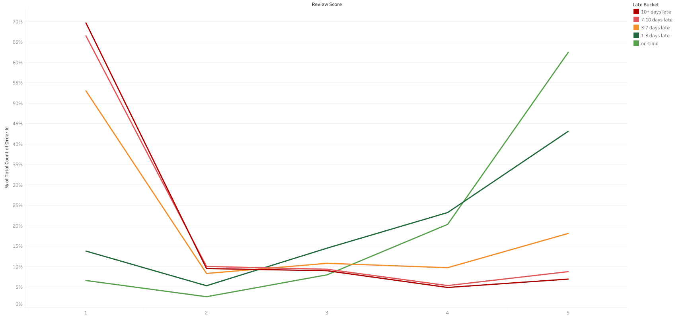

# Delivery Lateness & Customer Satisfaction — Olist E-Commerce Analysis

Analyzing whether late deliveries measurably hurt customer review scores across ~96,000 orders from the Olist Brazilian e-commerce dataset.

## Overview

This project tests a simple business question: **does delivery lateness lower customer satisfaction?** Orders were grouped by delivery timing (early, on-time, late) and compared against their 1–5 star review scores using non-parametric statistical testing.

## Average Review Score by Delivery Status

## Methodology

- Cleaned and merged Olist order, review, and delivery tables in **Python / pandas**
- Engineered a delivery-status feature by comparing actual vs. estimated delivery dates
- Ran a **Kruskal-Wallis H test** to check for significant differences in review scores across groups
- Applied **Dunn's post-hoc test** to identify which specific groups differed
- Built **Tableau** visualizations to communicate findings

## Tools Used

- Python (Pandas, SciPy)
- Tableau
- Jupyter Notebook
- SQL/SQLAlchemy/SQLite

## Conclusion

Delivery timing has a statistically significant effect on customer satisfaction. Late deliveries pull average review scores down sharply, while early deliveries provide little additional lift over on-time ones — meaning the priority for the business is **avoiding lateness**, not delivering ahead of schedule. This points to clear, actionable value in tightening logistics around the estimated delivery window.
